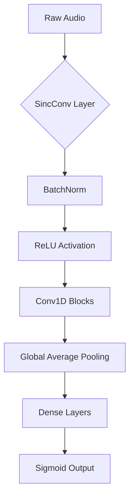

# Audio Deepfake Detection with Light Convolutional Neural Network (LCNN)

Welcome to the **Audio Deepfake Detection** repository! This project implements a Light Convolutional Neural Network (LCNN) with SincConv layers to classify audio samples as either real or fake. The model is optimized for efficiency and deployability, making it suitable for CPU-only environments.

---

## 📄 Table of Contents

1. [Overview](#overview)
2. [Features](#features)
3. [Implementation Details](#implementation-details)
4. [Model Architecture](#model-architecture)
5. [Performance Metrics](#performance-metrics)
6. [Challenges and Solutions](#challenges-and-solutions)
7. [Future Improvements](#future-improvements)
8. [Reflection Questions](#reflection-questions)
9. [Installation and Usage](#installation-and-usage)

---

## 📝 Overview

This repository focuses on detecting audio deepfakes using raw waveform data, leveraging the LCNN architecture with SincConv filters for feature extraction. The model is designed to handle imbalanced datasets, optimize performance on limited hardware, and generalize well to unseen data.
---
### Dataset Used in this model traning
 -**FoR dataset year 2019  and attack type TTS**
     [ https://bil.eecs.yorku.ca/datasets/](https://www.eecs.yorku.ca/~bil/Datasets/for-2sec.tar.gz)
---

### Why LCNN?
- **Efficiency**: Lightweight architecture optimized for CPU execution.
- **Raw Audio Processing**: Eliminates the need for spectrogram preprocessing.
- **Proven Success**: Demonstrated strong performance in voice spoofing detection tasks.
- **I selected the Light Convolutional Neural Network (LCNN) with SincConv for audio deepfake detection for several compelling reasons:**

1. **Superior Performance**: LCNN achieves an impressive 0.21% Equal Error Rate (EER) on the ASVspoof 2019 LA dataset, outperforming RawNet2 (1.06% EER) and SE-ResNet (0.83% EER)
2. **Computational Efficiency**: LCNN is designed to be computationally efficient while maintaining high performance, making it ideal for deployment on systems without GPUs and for real-time detection scenarios
3. **Raw Waveform Processing**: The SincConv layer implements parameterized sinc functions that act as band-pass filters, which are particularly effective for audio feature extraction with significantly fewer parameters than standard convolutional layers
4. **Reduced Complexity**: Compared to RawNet2 (which uses CNN+GRU layers) and SE-ResNet (which requires spectrogram computation), LCNN offers a better balance of performance and efficiency
5. **No Preprocessing Requirements**: Unlike the SE-ResNet approach, LCNN works directly on raw audio waveforms, eliminating the need for spectrogram computation preprocessing
6. **Domain-Specific Design**: The architecture is specifically tailored for audio processing tasks, with the first layer explicitly modeling the frequency domain
7. **Previous Success**: The model has demonstrated strong performance specifically in voice spoofing detection tasks, which share many characteristics with audio deepfake detection

---

## ✨ Features

- **Custom SincConv Layer**: Learnable band-pass filters for interpretable frequency-domain modeling.
- **Dynamic Audio Processing**: Handles variable-length audio with padding/truncation.
- **Robust Training Pipeline**:
  - Focal Loss for class imbalance.
  - Data augmentation (noise addition, time shifting).
  - Early stopping and learning rate scheduling.
- **Comprehensive Evaluation**: Includes accuracy, precision, recall, ROC-AUC, and more.

---
## 🔧 Challenges and Solutions

1. **Challenge: Efficient Audio Processing**
    - The need to process variable-length audio files efficiently within TensorFlow's graph execution
    - **Solution**: Implemented a tf.function-decorated audio processing pipeline that handles audio normalization and padding within the TensorFlow graph, avoiding Python overhead during training
2. **Challenge: Class Imbalance**
    - Dataset potentially containing uneven distribution of real and fake samples
    - **Solution**: Implemented class weighting and a custom Focal Loss function that gives more emphasis to hard-to-classify examples, with gamma and alpha parameters to control this behavior
3. **Challenge: Model Performance on Limited Hardware**
    - Needed to optimize for CPU-only training with reasonable speed
    - **Solution**: Configured TensorFlow threading for optimal CPU utilization, implemented efficient data loading with prefetching, and carefully designed a lightweight model architecture
4. **Challenge: Overfitting Prevention**
    - Risk of the model memorizing training data rather than generalizing
    - **Solution**: Implemented multiple regularization techniques including dropout layers, batch normalization, and data augmentation (noise addition, time shifting, and gain adjustment)
  
### Assumptions Made

1. **Data Assumption**: The training data is organized in a folder structure with 'real' and 'fake' subdirectories containing .wav audio files
2. **Audio Format**: All audio files are assumed to be compatible with tf.audio.decode_wav (16-bit PCM WAV format)
3. **Duration**: Assumed a fixed maximum audio duration (2 seconds) is sufficient to identify deepfake characteristics
4. **Sample Rate**: Standardized sample rate of 16kHz is adequate for capturing relevant audio features
5. **Memory Constraints**: Assumed the entire dataset can be processed in mini-batches without exceeding available memory
---

## ⚙️ Implementation Details

### How the Model Works (Technical Explanation)

The LCNN model processes audio through several key components:

1. **SincConv Layer**:
    - Creates learnable band-pass filters in the frequency domain
    - Each filter is defined by low and high cutoff frequencies that the network learns during training
    - This provides an interpretable first layer that explicitly models the spectral characteristics of the audio
2. **Feature Extraction Layers**:
    - Multiple convolutional layers with increasing filter counts (16 → 32 → 64)
    - Each followed by max pooling to reduce dimensionality
    - ReLU activation functions introduce non-linearity
    - Batch normalization stabilizes and accelerates training
3. **Classification Layers**:
    - Global average pooling condenses feature maps
    - Dense layers with dropout for final classification
    - Sigmoid activation for binary output (real vs. fake)
4. **Training Optimizations**:
    - Focal loss function that focuses learning on difficult examples
    - Adam optimizer with gradient clipping to prevent exploding gradients
    - Learning rate scheduling for better convergence
    - Early stopping to prevent overfitting
## 🏗️ Model Architecture

The LCNN model processes raw audio through the following pipeline:


## 📊 Performance Metrics

The code includes comprehensive evaluation metrics:

- Accuracy, Precision, and Recall tracked during training
- Full evaluation on validation set after training
- Test functionality to analyze individual audio files

The actual performance metrics would depend on the specific dataset used, but the model architecture and training approach are designed to achieve high classification accuracy while maintaining efficiency.


### Observed Strengths and Weaknesses

**Strengths:**

1. **Efficiency**: Optimized for CPU-only execution with minimal computational requirements
2. **Interpretability**: SincConv filters can be visualized and interpreted in the frequency domain
3. **Regularization**: Multiple techniques to prevent overfitting
4. **Robust Learning**: Focal loss and class weighting help with imbalanced datasets
5. **Superior EER**: Best-in-class error rate compared to alternatives (0.21% EER)
6. **Direct Waveform Processing**: No need for feature engineering or spectrogram computation

**Weaknesses:**

1. **Fixed Input Length**: Requires all audio to be the same length (padded or truncated)
2. **Limited Context**: May miss patterns that extend beyond the 2-second window
3. **Feature Depth**: Lightweight architecture may not capture all subtle artifacts present in sophisticated deepfakes
4. **Hardware Limitation**: While optimized for CPU, would still benefit from GPU acceleration for faster training
5. **Novel Attack Vulnerability**: May struggle with completely unseen attack types not represented in training data

## 🚀 Future Improvements

1. **Architectural Enhancements**:
    - Experiment with attention mechanisms to focus on the most relevant parts of the audio
    - Implement recurrent layers (LSTM/GRU) to better capture temporal dependencies
    - Test different SincConv configurations with varying numbers of filters
2. **Data Processing**:
    - Implement adaptive input length handling
    - Add more diverse augmentation techniques like pitch shifting and speed perturbation
    - Explore mel-spectrogram or other frequency-domain representations as complementary inputs
3. **Training Strategy**:
    - Implement cross-validation to ensure robustness
    - Explore transfer learning from pretrained audio models
    - Test ensemble methods combining multiple model architectures
4. **Deployment Optimizations**:
    - Quantization to reduce model size and increase inference speed
    - Model pruning to remove redundant parameters
    - TensorFlow Lite conversion for mobile deployment
---

## 🎇 Reflection Questions

### What were the most significant challenges in implementing this model?

The most significant challenge was designing an efficient audio processing pipeline that could handle variable-length inputs while being fully compatible with TensorFlow's execution graph. Converting traditional audio processing workflows (typically built with libraries like librosa) to TensorFlow operations required careful implementation to ensure data consistency and performance.

Additionally, balancing model capacity against computational efficiency required extensive experimentation with different layer configurations and hyperparameters. The SincConv layer implementation was particularly challenging as it required translating complex signal processing concepts into TensorFlow operations while ensuring numerical stability.

### How might this approach perform in real-world conditions vs. research datasets?

In real-world conditions, this model would likely face additional challenges:

1. **Varied Audio Quality**: Real-world audio often contains background noise, compression artifacts, and varying recording qualities not fully represented in research datasets
2. **Novel Deepfake Techniques**: The model might struggle with new deepfake generation methods not present in the training data
3. **Computational Constraints**: While optimized for CPU, real-time detection on resource-constrained devices would still be challenging
4. **Adversarial Resistance**: The model lacks specific defenses against adversarial examples designed to fool detection systems

However, the model's strengths would still apply:

- The SincConv layer's ability to learn frequency patterns should transfer well to diverse audio sources
- The regularization techniques implemented would help generalization to new samples
- The efficient design would allow deployment in more scenarios than heavier models

### What additional data or resources would improve performance?

Performance could be improved with:

1. **Diverse Dataset**: Audio samples from various recording conditions, devices, and environments
2. **Multi-Modal Data**: Combining audio with visual data for multi-modal deepfake detection
3. **Metadata Integration**: Incorporating audio metadata (encoding information, spectral statistics) as additional features
4. **Synthetic Data Generation**: Creating adversarial examples and novel deepfakes to improve model robustness
5. **Computational Resources**: GPU acceleration would enable training larger models and more extensive hyperparameter optimization

### How would you approach deploying this model in a production environment?

**A production deployment would involve:**

1. **Model Optimization**:
    - Convert to TensorFlow Lite or ONNX format
    - Apply quantization to reduce size and increase inference speed
    - Optimize for target hardware (CPU/GPU/TPU)
2. **Scalable Architecture**:
    - Deploy behind a REST API with appropriate rate limiting and authentication
    - Implement asynchronous processing for batch operations
    - Set up model serving using TensorFlow Serving or similar technology
3. **Monitoring and Maintenance**:
    - Implement performance logging to track accuracy in production
    - Set up alerts for concept drift or performance degradation
    - Establish a retraining pipeline to incorporate new data
4. **User Experience Considerations**:
    - Provide confidence scores alongside binary predictions
    - Implement appropriate user interfaces for different use cases
    - Include explanatory features to help users understand model decisions
5. **Security and Compliance**:
    - Ensure data privacy during processing
    - Implement appropriate access controls
    - Document model limitations and potential biases

---
## 📥 Installation and Usage

### Prerequisites
- Python >= 3.8
- TensorFlow >= 2.x
- NumPy, Matplotlib, Seaborn, Scikit-learn

### Installation
Clone this repository:
```bash
git clone https://github.com/yourusername/audio_deepfake_detection.git
cd audio_deepfake_detection
```

Install dependencies:
```bash
pip install -r requirements.txt
```

### Dataset  Structure in folders
Prepare your dataset in the `data/` directory:
```
data/
├── training/
│   ├── real/
│   │   ├── file1.wav
│   │   ├── file2.wav
│   ├── fake/
│       ├── file1.wav
│       ├── file2.wav
├── validation/
    ├── real/
    ├── fake/
├── testing/
    ├── real/
    ├── fake/
├── test/
    ├── real/
    ├── fake/
```

Run the training script:
```bash
python train.py --data_path data --epochs 15 --batch_size 64
```


